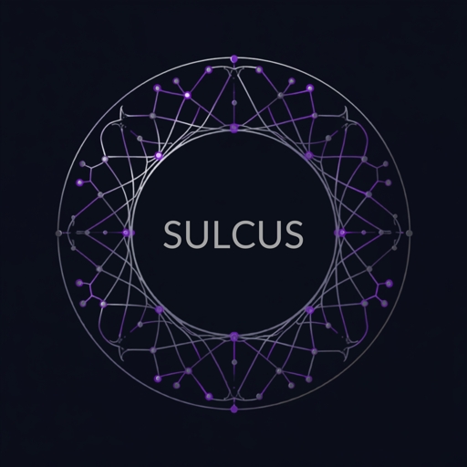

<div align="center">


# Sulcus.pro
### The Autonomous Corporate Nervous System

*Living operational memory that ingests, contradicts, sleeps, and heals — then renders generative UI instead of text.*

</div>

---

## What this is

Sulcus is a self-contained, interactive prototype of a next-generation corporate intelligence engine. It moves past static Vector-RAG by treating company data as a **continuous stream of living events**, then uses a nightly **Circadian Consolidation Loop** to garbage-collect obsolete vectors, reconcile contradictions, and rewrite its long-term knowledge graph.

It is **not** a single mock script with hardcoded numbers. It is a small modular engine where the trust metrics are **genuinely computed**.

### The four pillars (all real code, not stubs)

| Pillar | Module | What it actually does |
|---|---|---|
| **The Ears** — Ingestion Stream | `sulcus/ingestion.py` | Append-only event log fed by 3 pluggable connectors (Slack, GitHub, CRM). Supports tombstoning + corpus extraction. |
| **The Storyline** — State Engine | `sulcus/state_engine.py` | Deterministic tick state machine. Each `advance()` ingests new events, runs guardrails, writes audit trail. |
| **The Shields** — Dual Guardrails | `sulcus/guardrails.py` | **Gate 1**: live Pydantic v2 schema validation (+ a deliberately malformed payload that gets quarantined to prove the shield is live). **Gate 2**: token-grounded faithfulness + context-precision scoring against the raw corpus. |
| **The Mouth** — Generative UI | `sulcus/generative_ui.py` | Renders typed canvas objects into custom HTML/CSS assets (calendar, pre-mortem, 3×3 risk matrix, terminal console) — no text generation. |

The **Circadian loop** (`sulcus/circadian.py`) fires on Tick 2: it sweeps the conflicting Slack/GitHub vectors, GCs the obsolete Stripe dependencies, and rewrites the graph from Friday → Tuesday.

---

## The metrics are computed, not faked

This is the important part for anyone evaluating the project. The faithfulness and precision scores in the Transparency Center are **derived at runtime** by comparing the generated canvas claims against the token corpus of the active ingestion events — not hardcoded constants.

Observed (and test-asserted) progression as you advance the storyline:

| Tick | Story | Faithfulness | Gate 2 | Why |
|---|---|---|---|---|
| 0 | Ideal plan | **1.00** | PASSED | Every claim grounded in source events |
| 1 | Hidden crisis | **0.40** | WARNING | GitHub failure contradicts the PM milestone — drift detected |
| 2 | Pivot + circadian | **0.98** | PASSED | Conflict reconciled, obsolete vectors tombstoned |

Schema validation holds `0` live errors throughout while quarantining `3` malformed candidates each tick — proving Gate 1 is actively running, not decorative.

---

## Run it locally

```bash
pip install -r requirements.txt
streamlit run app.py
```

Opens at `http://localhost:8501`. Click **Advance Simulation Storyline** to walk Tick 0 → 1 → 2.

Requirements: Python 3.9+, `streamlit>=1.36`, `pandas>=2.0`, `pydantic>=2.6`.

---

## Project layout

```
sulcus/
├── app.py                  # Streamlit UI orchestration (split-screen, tabs, transparency center)
├── requirements.txt
├── README.md
├── .streamlit/config.toml  # dark theme, violet primary
├── assets/
│   ├── sulcus_logo.png      # original 2000x2000
│   └── sulcus_logo_sm.png   # 512px header thumbnail
└── sulcus/                  # the engine package
    ├── schemas.py           # Pydantic v2 models (events, canvas, guardrail reports)
    ├── ingestion.py         # connectors + append-only stream  (The Ears)
    ├── storyline.py         # per-tick typed canvas builder
    ├── guardrails.py        # Gate 1 schema shield + Gate 2 eval loop  (The Shields)
    ├── circadian.py         # nightly consolidation / graph rewrite
    ├── state_engine.py      # tick state machine  (The Storyline)
    └── generative_ui.py     # HTML/CSS asset renderers  (The Mouth)
```

---

## Deploying to sulcus.pro — read this first

You bought the domain `sulcus.pro`. Pointing it at this app takes one extra step depending on host, because **Streamlit Community Cloud (the free `*.streamlit.app` tier) does not support custom domains.** Three honest paths:

1. **Render / Railway / Fly.io (recommended).** Deploy the repo as a web service with start command `streamlit run app.py --server.port $PORT --server.address 0.0.0.0`, then add `sulcus.pro` as a custom domain in the host's dashboard and set the DNS records they give you. All three support custom domains directly (Render & Fly on paid/hobby tiers, Railway with its domain feature).
2. **Cloudflare reverse proxy in front of Streamlit Cloud.** Deploy free to `your-app.streamlit.app`, then put `sulcus.pro` on Cloudflare and proxy to it. Works, but it's a workaround and websocket config can be fiddly.
3. **Your own VPS** (DigitalOcean/EC2) behind nginx + a Let's Encrypt cert for `sulcus.pro`. Most control, most setup.

For a demo you want to share quickly: ship to Streamlit Cloud first (free, 2 minutes, gives a working `*.streamlit.app` link), then graduate to Render + `sulcus.pro` when you want the branded URL.

---

## Notes

- A benign `use_container_width` deprecation warning may appear in logs (Streamlit is migrating to `width=`). It does not affect the app and is safe until the deprecation date.
- Everything is deterministic — the same tick always produces the same graph state, which makes the eval scores reproducible and defensible.
